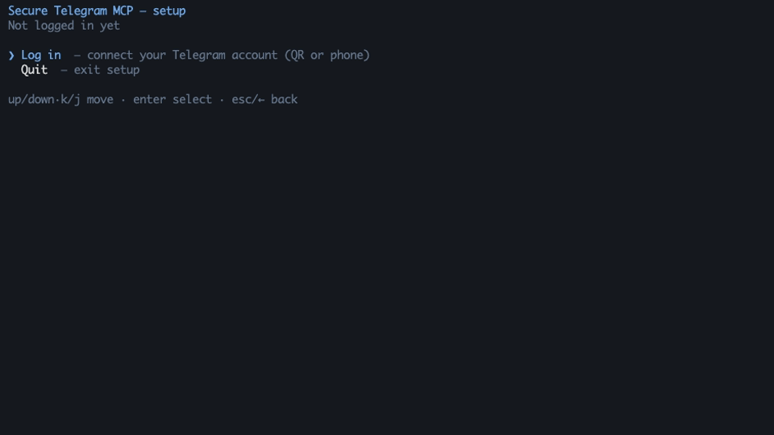

<div align="center">

<picture>
  <source media="(prefers-color-scheme: dark)" srcset="./docs/banner-dark.svg">
  
</picture>

**Connect Claude, Cursor, or any MCP client to Telegram — without handing any of them your whole account.**


[](https://www.npmjs.com/package/secure-telegram-mcp)
[](https://github.com/antonorlov/secure-telegram-mcp/actions/workflows/ci.yml)



*The demo runs against synthetic data — no real Telegram connection, no usable credential.*

</div>

## ❌ The usual Telegram MCP setup

- The AI client holds your **full account session** — every chat, every contact, every write.
- Access is **all-or-nothing**: your work agent can read your family group.
- The session credential sits in **plaintext** in a config file or `.env`.

## ✅ With secure-telegram-mcp

- Each AI client gets an **endpoint**: its own API key, scoped to the chats and folders you pick.
- **Read/write verbs are re-checked on every call** and fail closed — the tool menu is discovery, not authority.
- The Telegram session is **encrypted at rest** (AES-256-GCM, scrypt-wrapped keys), machine-bound by default or PIN-protected.

For example:

| AI client | Endpoint | Account | Telegram scope | Access |
| --- | --- | --- | --- | --- |
| Personal agent | `personal` | `main` | private chats | read + write |
| Work agent | `work` | `work-acc` | the `Work` folder | read-only |

Every MCP connection authenticates one endpoint and receives a scope-bound Telegram adapter for that endpoint's account. Endpoints can ride different logged-in accounts; endpoints on the same account share one background Telegram connection. Out-of-scope chats are not addressable at all.

## Features

- 🔑 **Per-endpoint API keys** — each AI client gets its own key and scope, pinned to one of your logged-in accounts (one or many); only salted key hashes are stored.
- 📁 **Folder-scoped access** — bind an endpoint to Telegram folders, chats, or channels; write access is opt-in per endpoint.
- 🔒 **Encrypted session at rest** — AES-256-GCM envelopes for sessions and policy; PIN, recovery-keyfile, and machine-bound unlock slots.
- 🚦 **Anti-ban pacing** — per-account token buckets on messages, forwards, and search, plus a circuit breaker that backs the whole account off at the first sign of saturation. Pacing lowers the risk of flood limits; nothing can guarantee against a ban.
- 👤 **Human-in-the-loop writes** — optional per-endpoint confirmation; requires a client that supports MCP elicitation. On clients that don't, a confirm-writes endpoint fails closed: writes are blocked, never silent.
- ⛔ **No raw MTProto surface** — no `invoke` escape hatch, no model-accessible scope mutation; a CI architecture guard keeps it that way.

## Quickstart

**Prerequisites:** Node.js ≥ 20.10 and Telegram `api_id`/`api_hash` from [my.telegram.org/apps](https://my.telegram.org/apps).

### 1. Run setup

```bash
npx -y secure-telegram-mcp setup
```

Setup walks you through, in order:

1. **Telegram app credentials** — the `api_id` / `api_hash` from the prerequisite link.
2. **Login method** — QR code (scan from a phone that's already logged in) or phone number + code. If your account has two-step verification, setup also asks for that password.
3. **Session name** — press Enter to accept the suggestion (your Telegram username, or `main` if you have none).
4. **PIN or no PIN** — default is no PIN (encryption keyed to this machine, nothing to unlock). With a PIN you re-enter it after each reboot; a forgotten PIN is unrecoverable.
5. **Endpoint** — name it, then pick chats/folders in the picker: `r` or Space grants read, `w` write, `s` saves, `?` shows the full keymap.

At exit the endpoint's API key is printed **once**, inside a ready-to-paste client config — copy it before closing the terminal. Hit a snag? See [Troubleshooting](./docs/USAGE.md#troubleshooting).

### 2. Add the endpoint to *one* MCP client

```json
{
  "mcpServers": {
    "telegram": {
      "command": "npx",
      "args": ["-y", "secure-telegram-mcp", "connect"],
      "env": {
        "TELEGRAM_MCP_ENDPOINT_TOKEN": "tgmcp_..."
      }
    }
  }
}
```

The token alone selects and authorizes the endpoint — no `api_id`, `api_hash`, or PIN material ever goes into client config. Setup prints one block per endpoint; each goes only into its own client — combining entries in one client intentionally grants it the union of the scopes.

<details>
<summary><b>Claude Code</b></summary>

```bash
claude mcp add telegram --env TELEGRAM_MCP_ENDPOINT_TOKEN=tgmcp_... -- npx -y secure-telegram-mcp connect
```

</details>

<details>
<summary><b>Claude Desktop</b></summary>

Add the JSON block above to `claude_desktop_config.json` (Settings → Developer → Edit Config).

</details>

<details>
<summary><b>Cursor</b></summary>

[](https://cursor.com/en/install-mcp?name=telegram&config=eyJjb21tYW5kIjoibnB4IiwiYXJncyI6WyIteSIsInNlY3VyZS10ZWxlZ3JhbS1tY3AiLCJjb25uZWN0Il0sImVudiI6eyJURUxFR1JBTV9NQ1BfRU5EUE9JTlRfVE9LRU4iOiJ0Z21jcF9QQVNURV9ZT1VSX0VORFBPSU5UX1RPS0VOIn19)

Run setup first, then click and replace the placeholder token — or add the JSON block above to `~/.cursor/mcp.json` yourself.

</details>

<details>
<summary><b>VS Code</b></summary>

[](https://insiders.vscode.dev/redirect/mcp/install?name=telegram&inputs=%5B%7B%22type%22%3A%22promptString%22%2C%22id%22%3A%22endpoint_token%22%2C%22description%22%3A%22Endpoint%20token%20printed%20by%20setup%20(tgmcp_...)%22%2C%22password%22%3Atrue%7D%5D&config=%7B%22command%22%3A%22npx%22%2C%22args%22%3A%5B%22-y%22%2C%22secure-telegram-mcp%22%2C%22connect%22%5D%2C%22env%22%3A%7B%22TELEGRAM_MCP_ENDPOINT_TOKEN%22%3A%22%24%7Binput%3Aendpoint_token%7D%22%7D%7D)

VS Code prompts for the endpoint token as a masked secret — it never lands in a settings file in plain sight of other extensions' recommendations.

</details>

<details>
<summary><b>Docker</b></summary>

See [Usage and operations → Docker](./docs/USAGE.md#docker) for the setup and stdio-connect containers.

</details>

### 3. Unlock (PIN posture only)

If you kept the default machine-bound protection, skip this — the service starts automatically when a client connects. With a PIN:

```bash
npx -y secure-telegram-mcp start
```

Enter the PIN interactively; clients never need it. Multi-client examples, unattended unlock, environment variables, and manual policy editing live in [Usage and operations](./docs/USAGE.md).

## Tools

18 tools, gated by 8 permission verbs that are checked at execution time.

| Category | Tools | Verb |
| --- | --- | --- |
| Read | `get_messages`, `search_messages`, `list_dialogs`, `list_topics`, `get_chat_info`, `get_media_info`, `get_pinned_messages`, `list_participants` | `read` |
| Media download | `download_media` (strict size cap, server-chosen destination) | `read_media` |
| Send & edit | `send_message`, `edit_message`, `prepare_media`, `send_media` | `send` |
| Other writes | `save_draft`, `delete_message`, `mark_read`, `send_reaction`, `forward_message` | `draft`, `delete`, `mark_read`, `react`, `forward` |

Forwarding is two-sided: `read` on the source chat *and* `forward` on the destination. Sending local media is a deliberate two-phase flow — `prepare_media` returns an opaque, expiring handle for a file inside the confined media root; `send_media` consumes it. The full catalogue and verb semantics are in [Usage and operations](./docs/USAGE.md#tool-catalogue).

## Security model

- One local service owns the encrypted Telegram session and the sealed policy; MCP shims never open a second Telegram session.
- Every call re-verifies the endpoint token against the current sealed policy, so rotating a key revokes live connections.
- There is no raw MTProto tool and no way for the model to widen its own scope.
- Writes pass ACL → optional human confirmation → quota → audit, in that order, and fail closed at each gate.
- Telegram prose is Unicode-sanitized (control/format characters stripped, length-capped) before it reaches the model; writes, denials, and media egress land in an append-only NDJSON audit log.
- **Known limits:** the enforcement boundary is your local OS user; endpoint ACLs cannot shrink what the underlying full-account session could do if the process itself were compromised; sanitization cannot neutralize semantic prompt injection.

A read-only endpoint attempting `send_message` is stopped at the ACL gate and audited — one NDJSON line, no message content:

```json
{"v":1,"timestampIso":"2026-07-17T09:41:22.310Z","endpointName":"work","verb":"send","outcome":"deny","targetChatId":"-1001234567890","reason":"VERB_NOT_GRANTED"}
```

The client sees only an `ACL_DENIED` error. An out-of-scope peer denies the same way, with `PEER_OUT_OF_SCOPE`.

Read the complete [threat model](./SECURITY.md) — including non-objectives and residual risks — before pointing this at a Telegram account you care about. Component boundaries are in [Architecture](./ARCHITECTURE.md).

## Documentation

- [Usage and operations](./docs/USAGE.md) — clients, endpoints, commands, environment variables, Docker, media, tool catalogue.
- [Security](./SECURITY.md) — threat model, guarantees, residual risks, hardened deployment.
- [Architecture](./ARCHITECTURE.md) — process ownership, trust boundaries, policy lifecycle.
- [Example configuration](./telegram-mcp.config.example.json) — schema-valid, deliberately unusable placeholders.

## Development

```bash
npm run ci     # typecheck + lint + architecture guard + knip + tests
npm run build
```

The architecture guard rejects forbidden MCP surfaces and unreviewed MTProto request constructors; ESLint enforces dependency boundaries and confines GramJS to the infrastructure layer. See [CONTRIBUTING.md](./CONTRIBUTING.md) before opening a PR.

<!-- TODO: uncomment when wanted
## Star history

[](https://star-history.com/#antonorlov/secure-telegram-mcp&Date)

If this project is useful to you, a ⭐ helps other people find it.
-->

## License

[MIT](./LICENSE)

---

*Unofficial project: not affiliated with, endorsed by, or sponsored by Telegram FZ-LLC.
"Telegram" is a trademark of Telegram FZ-LLC. This software connects to the Telegram API;
each user supplies their own API credentials.*
